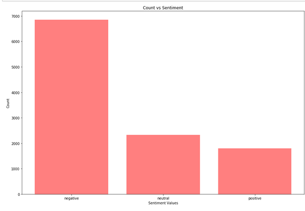
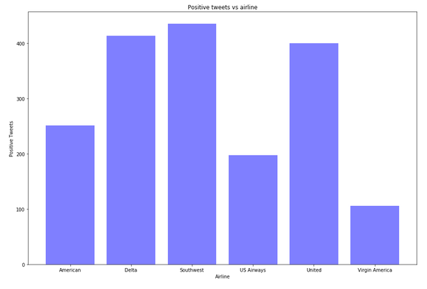
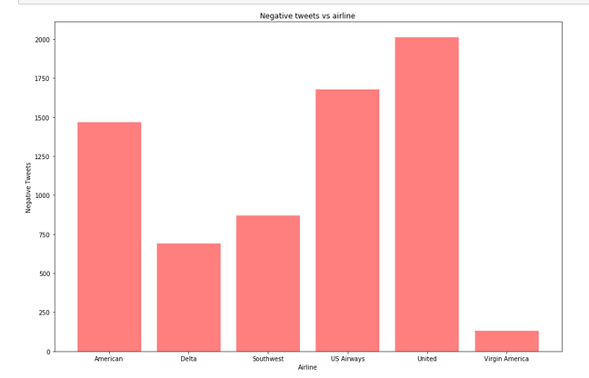
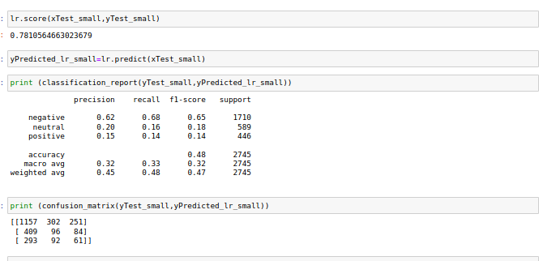

# SENTIMENT ANALYSER

The goal of this project is to create a text classifier that tells tweets from a twitter feed as positive negative or neutral.The model is trained using the data from twitter_x_y.csv and predictions are done for twitter_x_test.csv and saved in predictions.csv.  

### DATA GATHERING
Dataset was taken from Kaggle(https://www.kaggle.com/crowdflower/twitter-airline-sentiment).

### Data analysis
Some EDA analysis of the dataset.

### Preprocessing
-> For numeric entries the nan values were replaced by the most occuring datapoints in that column.

-> NLP was used for this process using bag of words technique and count vectoriser for getting features from the top occuring words.   

### Training
-> The model was trained on various models like Logistic Regression,Support Vector Machine and Multinomial Naive Bayes having maximum f1 score using Logisitic Regression.  

## TODO's
-> Use twitter api for live data interfacing.
-> Add a flask backend and convert it into a webpage. 

